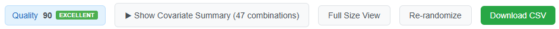
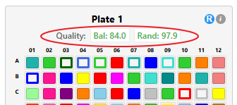
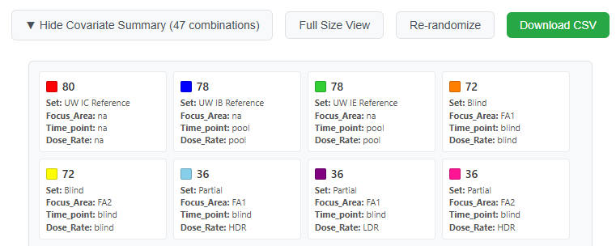
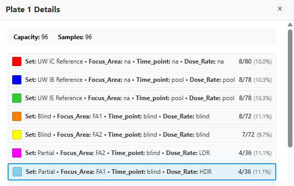
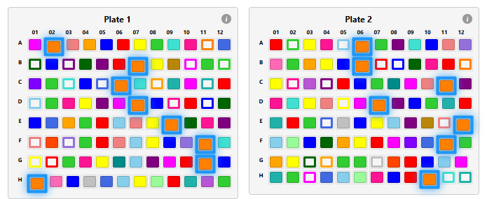
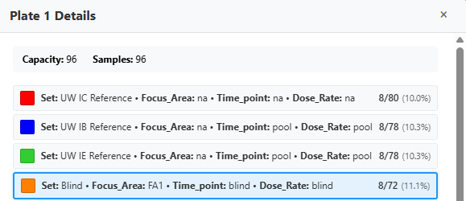
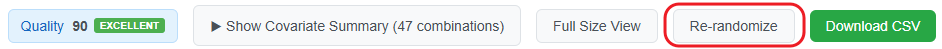

# Octopus Block Randomization - Feature Updates

## Overview

This document describes the enhancements made to the Octopus Block Randomization app for distributing samples across plates.


## 1. Updated Color Palette

- **Palette Size**: Expanded to 24 distinct, bright colors organized into 4 subgroups for better visual separation
- **Color Assignment Strategy**: Colors are assigned based on sample counts (descending order), with priority given to control/reference samples

- **Handling Large Numbers of Covariate Groups**: When the number of unique covariate groups exceeds 24, the colors are recycled, and the following approach is used for display:

|  |  |
|-------------|---------------|
| Groups 1-24 | **Solid fill** with the assigned color |
| Groups 25-48 | **Outline only** using the assigned color (transparent fill) |
| Groups 49-72 | **Diagonal stripes** pattern using the assigned color |

This approach supports up to 72 unique covariate groups.

---

## 2. Updated Configuration Form

The configuration form includes new options:


### ID Column Selection
- Allows users to specify which column contains the unique sample identifiers. Users can select from the available columns in the uploaded CSV file.

### Algorithm Selection
Users can choose between two randomization strategies:

1. **Balanced Randomization** (_New_)
   - Proportionally distributes samples across plates
   - Maintains balance within plate rows

2. **Greedy Algorithm** (_Legacy_)
   - Original algorithm implementation
   - Places samples iteratively with tolerance-based placement

### Control/Reference Sample Field
- Comma-separated list of labels (e.g., "Control, QC, Reference")
- Covariate groups containing these labels receive priority in color assignment - brighter colors assigned to make them more recognizable.

### Plate Dimensions (_only available for the Balanced Randomization algorithm_)
- **Rows**: Configurable from 1-16 (default: 8)
- **Columns**: Configurable from 1-24 (default: 12)
- **Display**: Shows calculated plate capacity (rows × columns)

### Empty Cell Distribution (_only available for the Balanced Randomization algorithm_)
Option to control how empty cells / wells are handled when sample count < total capacity:

- **Keep empty cells in last plate** (default checked): All empty cells are assigned to the final plate
- **Distribute evenly** (unchecked): Empty cells spread across all plates

### Covariate Display
- Selected covariates displayed below the **Select Covariates** selection box

---

## 3. New Balanced Randomization Algorithm


#### Two-Level Distribution
1. **Plate Level**: Distributes samples proportionally across all plates
2. **Row Level**: Distributes samples proportionally within each plate's rows


##### Phase 1: Proportional Placement
- Calculates expected minimum samples per covariate group
- Adjusts for varying plate capacities
- Places base allocation across all blocks (plates or rows)

##### Phase 2A: Unplaced Groups
- Handles covariate groups too small for Phase 1
- Distributes samples across available capacity
- Largest covariate groups processed first

##### Phase 2B: Overflow Handling
- Places remaining samples from Phase 1
- Uses prioritization strategies:
  - **Plate level**: Prioritizes full-capacity plates
  - **Row level**: Prioritizes rows with fewer samples of the group


---

## 4. Quality Metrics

Quality assement includes scores that evaluates the balance and randomization quality of plate assignments. Quality scores are calculated automatically and updated in real-time as users make changes. The following scores are calculated:

#### __Balance Score__ (0-100)
- **Purpose**: Measures how well each plate represents the overall population
- **Calculation**: Based on relative deviation from expected covariate group proportions
- **Weighting**: Larger covariate groups have more influence on the score
- **Real-time**: Updates when all plates or single plates are re-randomized, and when samples are moved between or within plates

#### __Randomization Score__ (0-100)
- **Purpose**: Measures spatial clustering and randomness of sample placement
- **Calculation**: Analyzes neighbor relationships to detect clustering patterns
- **Method**: Counts samples from different covariate groups among spatial neighbors
- **Real-time**: Updates when samples are repositioned on plates

### Quality Score Display

#### __Overall Quality Button__
Located in the main control panel, shows:
- **Overall Score**: Average of **balance** and **randomization** scores
- **Quality Level**: Excellent (85+), Good (75-84), Fair (65-74), Poor (<65)



#### __Quality Assessment Popup__
Accessible via the quality button, provides:
- **Experiment Summary**: Overall scores and quality level
- **Individual Plate Scores**: Detailed breakdown for each plate


#### __Individual Plate Headers__
Each plate displays:
- **Bal**: Balance score for that specific plate
- **Rand**: Randomization score for that specific plate



---

## 5. Compact View Implementation

The original full-size plate view made it difficult to visualize sample distribution patterns across multiple plates simultaneously, especially when working with many plates. A compact view was added to enable quick overview of sample distribution over multiple plates.
Users can switch between views using the **Compact View** / **Full Size View** button in the control panel.


#### Compact View (Default)
- **Cell Size**: 18×16 pixels per cell
- Hover tooltip shows:
  - Sample name
  - Cell / well position (e.g., A05)
  - All covariate values

#### Full Size View (Toggle)
- **Cell Size**: 100×60 pixels per well
- Detailed information directly visible
  - Sample name prominently displayed
  - All covariate values shown within the plate cell

---

## 6. Covariate Groups Summary Panel

The summary panel provides an overview of all unique covariate groups.
- Toggle visibility using the "Show/Hide Covariate Summary" button.
- Summary items are sorted by sample count (descending) - covariate groups with most samples first.

#### Color Indicator
- Visual representation matching the plate display
- Shows fill pattern (solid/outline/stripes)

#### Sample Count
- Total number of samples in the group

#### Covariate Values
- Lists all covariate names and their values for the group
- Format: `Set: Training • Focus_Area: FA2 • Time_point: 21 • Dose_Rate: LDR`



---


## 7. Plate Details Popup

Click the information icon ("i") in the header of any plate. The draggable popup displays comprehensive information about the selected plate:



#### Header Section
- **Plate Title**: "Plate X Details" with plate number
- **Close Button**: X button to close the modal
- **Draggable**: Modal can be repositioned by dragging the header

#### Summary Statistics
- **Capacity**: Total number of cells / wells in the plate
- **Samples**: Number of samples actually placed in the plate
- **Quality Scores**: Balance and randomization scores

#### Covariate Distribution

The modal shows each covariate group with detailed information arranged in two columns:

**Left Column - Covariate Information:**
- **Color Indicator**: 16×16px color box matching plate display
- **Sample Proportions**: Shows count of samples from a covariate group in the plate / total samples in the covariate group.
- **Covariate Details**: All covariate values displayed on separate lines
  - Format: `Set: Training`, `Focus_Area: FA2`, etc.


**Right Column - Quality Metrics:**
- **Balance Score**: Individual balance score (0-100) with color coding
- **Expected Count**: Expected number of samples (with decimals)
- **Actual Count**: Actual number of samples on this plate
- **Deviation**: Percentage deviation from expected count
- **Weighted Deviation**: The weighted deviation value used in overall balance calculation

#### Real-time Updates
- All quality scores update automatically when samples are moved
- Covariate groups selected in the **Covariate Summary" view are highlighted in the popup

---

## 8. Interactive Highlighting

Clicking a covariate group in the summary panel highlights (blue border; glowing effect) all samples belonging to that group in all the plates.

- **Persistence**: Highlighting persists when switching between views
- **Plate Details popup sync**: selected group also highlighted in plate details popup
- **Toggle**: Clicking the same group again removes the highlighting





---

## 9. Re-randomization

The application provides two methods for re-randomizing samples to improve quality scores or generate alternative arrangements:

### Global Re-randomization ("Re-randomize" Button)

The main "Re-randomize" button in the control panel generates a completely new sample placement and randomization for all plates while preserving:



- Current covariate selections
- Algorithm choice
- Plate dimensions
- Color assignments
- Empty space distribution settings

### Individual Plate Re-randomization ("R" Button)

Each plate header includes an "R" button that re-randomizes only that specific plate.


#### Algorithm-Specific Behavior:
- **Balanced Randomization**: Shuffles samples within each row only (preserves balanced distribution in rows)
- **Other Algorithms**: Shuffles all samples across the entire plate

### Quality Score Updates

Both re-randomization methods automatically trigger:
- Recalculation of quality scores
- Real-time update of plate headers and quality button
- Refresh of quality assessment popup data

---
---

## Quality Score Calculation Details

### Balance Score
For each covariate group on each plate:
```
Expected Count = (Group Size / Total Samples) × Plate Capacity
Relative Deviation = |Actual - Expected| / Expected
Group Balance Score = max(0, 100 - (Relative Deviation × 100))
```

Overall plate balance uses weighted averaging:
```
Weight = Expected Proportion (group size / total samples)
Weighted Deviation = Relative Deviation × Weight
Plate Balance Score = max(0, 100 - (Sum of Weighted Deviations × 100))
```

### Randomization Score
For each sample position:
1. **Identify Neighbors**: All adjacent positions (8-directional)
2. **Compare Profiles**: Check if neighbors have different covariate combinations
3. **Calculate Ratio**: Different neighbors / Total neighbor comparisons
4. **Scale to 0-100**: Higher percentage = better randomization


### Quality Score Interpretation

#### Score Ranges
| Range | Level | Interpretation |
|-------|-------|----------------|
| 90-100 | Excellent | Near-perfect distribution/randomization |
| 80-89 | Good | Minor deviations, generally acceptable |
| 70-79 | Fair | Noticeable but manageable imbalances |
| 60-69 | Poor | Significant issues requiring attention |
| 0-59 | Very Poor | Major problems affecting study validity |

---
---


## Implementation Files

The original code was refactored, and new components and hooks were created to support the enhanced functionality including new randomization algorithm, quality scoring, individual plate re-randomization, and improved user interface.

### Core Components

- **App.tsx**: Main application managing state, interactions, and quality metrics integration
- **ConfigurationForm.tsx**: Enhanced form with algorithm selection, plate dimensions, and control sample options
- **Plate.tsx**: Individual plate rendering with compact/full views, quality scores display, and re-randomization buttons
- **PlatesGrid.tsx**: Grid layout management for multiple plates with quality metrics integration
- **SummaryPanel.tsx**: Covariate groups summary with interactive highlighting and sorting
- **PlateDetailsModal.tsx**: Draggable modal with enhanced covariate distribution, quality metrics, and real-time balance information
- **QualityMetricsPanel.tsx**: Quality assessment modal displaying overall scores, individual plate metrics, and recommendations
- **FileUploadSection.tsx**: File upload interface with validation and column detection

### Algorithm Files

- **balancedRandomization.ts**: Advanced balanced randomization with two-level distribution
- **greedyRandomization.ts**: Original greedy algorithm implementation (legacy support)
- **utils.ts**: Shared utilities including expanded color palette, covariate grouping, and CSV export functionality

### Quality Assessment System

- **qualityMetrics.ts**: Core quality calculation engine with balance and randomization scoring
- **useQualityMetrics.ts**: Hook for managing quality state, calculations, and real-time updates

### Custom Hooks

- **useCovariateColors.ts**: Advanced color assignment with priority handling and pattern support (solid/outline/stripes)
- **useRandomization.ts**: Randomization coordination with individual plate re-randomization and algorithm-specific behavior
- **useModalDrag.ts**: Draggable modal functionality with position management
- **useDragAndDrop.ts**: Sample drag-and-drop with automatic quality recalculation
- **useFileUpload.ts**: File upload management with CSV parsing and column detection

### Type Definitions

- **types.ts**: Comprehensive TypeScript interfaces including:
  - `SearchData`: Sample metadata structure
  - `QualityMetrics`: Quality assessment data structures
  - `PlateQualityScore`: Individual plate quality information
  - `CovariateColorInfo`: Color assignment and pattern definitions
  - `RandomizationAlgorithm`: Algorithm type definitions

### Utility Functions

- **Color Management**: 24-color palette with recycling and pattern support
- **Quality Calculations**: Balance scoring, spatial analysis, and weighted averaging
- **Data Processing**: Covariate grouping, sample distribution, and CSV handling
- **UI Helpers**: Drag and drop coordination, modal positioning, and state management


---

## Usage

1. **Upload CSV**: File containing sample metadata
2. **Configure**:
   - Select ID column
   - Choose covariates for balancing
   - (Optional) Enter control sample labels
   - Select randomization algorithm
   - Set plate dimensions
   - Choose empty space distribution strategy
3. **Generate**: Click "Generate Randomized Plates"
4. **Review**:
   - View sample distribution in compact or full view
   - Check covariate summary for balance
   - Click covariate groups in summary view to highlight samples in plates
   - Inspect individual plates using details modal
5. **Export**: Download CSV with plate assignments
