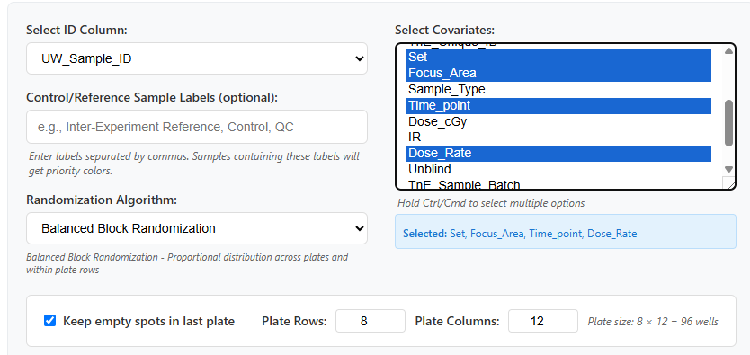
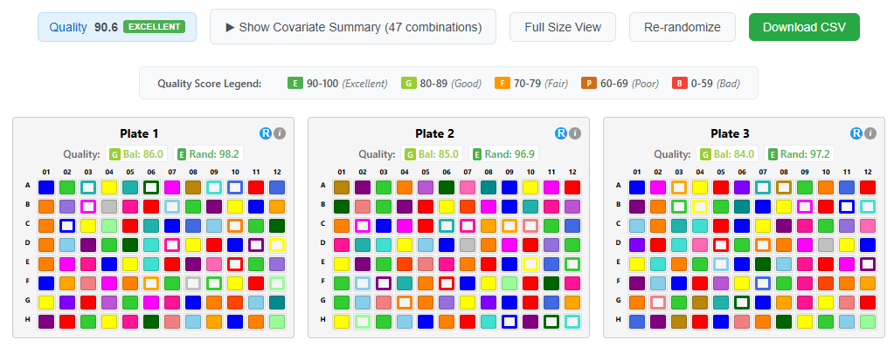
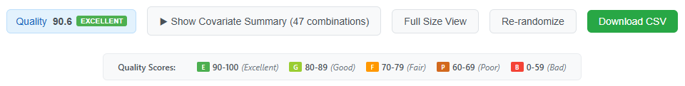
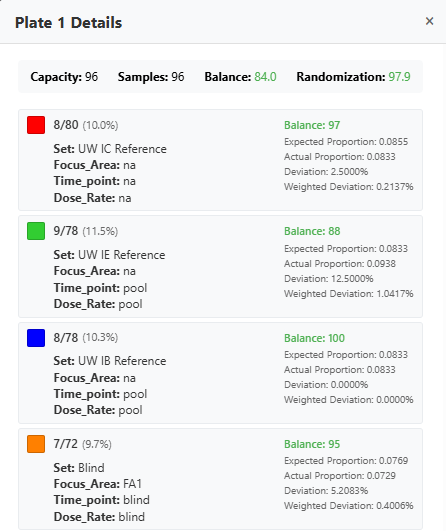
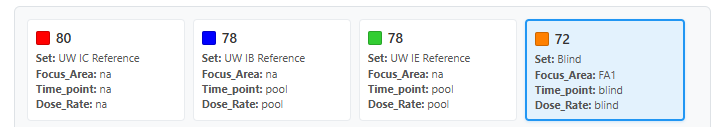
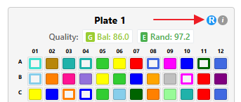

# Octopus Block Randomization - Feature Updates
<!-- ---
## _Sample placement algorithm and randomization score calculation are being updated.  Please check back later_ ##
--- -->
## Overview

This document describes the enhancements made to the Octopus Block Randomization app for distributing samples across plates.

<a id="table-of-contents"></a>
## Table of Contents

- [1. Updated Color Palette](#1-updated-color-palette)
- [2. Updated Configuration Form](#2-updated-configuration-form)
  - [ID Column Selection](#id-column-selection)
  - [Algorithm Selection](#algorithm-selection)
  - [Control/Reference Sample Field](#controlreference-sample-field)
  - [Plate Dimensions](#plate-dimensions-only-available-for-the-balanced-block--spatial-randomization-algorithm)
  - [Empty Cell Distribution](#empty-cell-distribution-only-available-for-the-balanced-block--spatial-randomization-algorithm)
  - [Covariate Display](#covariate-display)
- [3. Compact Plate View Implementation](#3-compact-plate-view-implementation)
- [4. Covariate Groups Summary Panel](#4-covariate-groups-summary-panel)
- [5. Quality Metrics](#5-quality-metrics)
  - [Quality Score Display](#quality-score-display)
- [6. Plate Details Popup](#6-plate-details-popup)
- [7. Interactive Highlighting](#7-interactive-highlighting)
- [8. Re-randomization](#8-re-randomization)
  - [Global Re-randomization](#global-re-randomization-re-randomize-button)
  - [Individual Plate Re-randomization](#individual-plate-re-randomization-r-button)
  - [Quality Score Updates](#quality-score-updates)
- [New Balanced Randomization Algorithm](#new-balanced-randomization-algorithms)
  - [Balanced Block Randomization](#balanced-block-randomization)
- [Quality Score Calculation](#quality-score-calculation)
  - [Balance Score](#balance-score)
- [Usage](#usage)

---


## 1. Updated Color Palette

- **Palette Size**: Expanded to 24 distinct, bright colors organized into 4 subgroups for better visual separation
- **Color Assignment Strategy**: Colors are assigned based on sample counts (descending order), with priority given to control/reference samples

- **Handling Large Numbers of Covariate Groups**: When the number of unique covariate groups exceeds 24, the colors are recycled, and the following approach is used for display:

|  |  |
|-------------|---------------|
| Groups 1-24 | **Solid fill** with the assigned color |
| Groups 25-48 | **Outline only** using the assigned color (transparent fill) |
| Groups 49-72 | **Diagonal stripes** pattern using the assigned color |

This approach supports up to 72 unique covariate groups.

[↑ Back to Table of Contents](#table-of-contents)

---

## 2. Updated Configuration Form

The configuration form includes new options:


### ID Column Selection
- Allows users to specify which column contains the unique sample identifiers. Users can select from the available columns in the uploaded CSV file.

### Algorithm Selection
Users can choose between three randomization strategies:

1. **Balanced Block Randomization** (_New_)
   - Proportionally distributes samples across plates
   - Maintains balance within plate rows

2. **Greedy Algorithm** (_Legacy_)
   - Original algorithm implementation
   - Places samples iteratively with tolerance-based placement

### Control/Reference Sample Field
- Comma-separated list of labels (e.g., "Control, QC, Reference")
- Covariate groups containing these labels receive priority in color assignment - brighter colors assigned to make them more recognizable.

### Plate Dimensions (_only available for the Balanced Block Randomization algorithm_)
- **Rows**: Configurable from 1-16 (default: 8)
- **Columns**: Configurable from 1-24 (default: 12)
- **Display**: Shows calculated plate capacity (rows × columns)

### Empty Cell Distribution (_only available for the Balanced Block Randomization algorithm_)
Option to control how empty cells / wells are handled when sample count < total capacity:

- **Keep empty cells in last plate** (default checked): All empty cells are assigned to the final plate
- **Distribute evenly** (unchecked): Empty cells spread across all plates

### Covariate Display
- Selected covariates displayed below the **Select Covariates** selection box

[↑ Back to Table of Contents](#table-of-contents)

---

## 3. Compact Plate View Implementation

The original full-size plate view made it difficult to visualize sample distribution patterns across multiple plates simultaneously, especially when working with many plates. A compact view was added to enable quick overview of sample distribution over multiple plates.
Users can switch between views using the **Compact View** / **Full Size View** button in the control panel.




#### Compact View (Default)
- **Cell Size**: 18×16 pixels per cell
- Hover tooltip shows:
  - Sample name
  - Cell / well position (e.g., A05)
  - All covariate values

#### Full Size View (Toggle)
- **Cell Size**: 100×60 pixels per well
- Detailed information directly visible
  - Sample name prominently displayed
  - All covariate values shown within the plate cell

[↑ Back to Table of Contents](#table-of-contents)

---

## 4. Covariate Groups Summary Panel

The summary panel provides an overview of all unique covariate groups.
- Toggle visibility using the "Show/Hide Covariate Summary" button.
- Summary items are sorted by sample count (descending) - covariate groups with most samples first.

#### Color Indicator
- Visual representation matching the plate display
- Shows fill pattern (solid/outline/stripes)

#### Sample Count
- Total number of samples in the group

#### Covariate Values
- Lists all covariate names and their values for the group
- Format: `Set: Training • Focus_Area: FA2 • Time_point: 21 • Dose_Rate: LDR`


[↑ Back to Table of Contents](#table-of-contents)

---


## 5. Quality Metrics

#### __Balance Score__ (0-100)
- **Purpose**: The balance score evaluates whether each plate contains a representative sample of the overall population based on selected covariates
- **Calculation**: Based on relative deviation from expected covariate group proportions
- **Weighting**: Larger covariate groups have more influence on the score
- **Real-time**: Updates when all plates or single plates are re-randomized, and when samples are moved between or within plates


### Quality Score Display

#### __Overall Quality Button__
Located in the main control panel, shows the overall score, and quality level



- Clicking on the quality buttons opens a popup with the balance scores for individual plates.
- Balance score can also be seen in the individual plate headers.

[↑ Back to Table of Contents](#table-of-contents)

---


## 6. Plate Details Popup

Click the information icon ("i") in the header of any plate. The draggable popup displays comprehensive information about the selected plate:




#### Header Section
- **Plate Title**: "Plate X Details" with plate number
- **Draggable**: Modal can be repositioned by dragging the header

#### Summary Statistics
- **Capacity**: Total number of cells / wells in the plate
- **Samples**: Number of samples actually placed in the plate
- **Quality Scores**: Balance score

#### Covariate Distribution

The popup shows each covariate group with detailed information arranged in two columns:

**Left Column - Covariate Information:**
- **Color Indicator**: 16×16px color box matching plate display
- **Sample Proportions**: Shows count of samples from a covariate group in the plate / total samples in the covariate group.
- **Covariate Details**: All covariate values displayed on separate lines
  - Format: `Set: Training`, `Focus_Area: FA2`, etc.


**Right Column - Quality Metrics:**
- **Balance Score**: Individual balance score (0-100) with color coding
- **Expected Count**: Expected number of samples (with decimals)
- **Actual Count**: Actual number of samples on this plate
- **Deviation**: Percentage deviation from expected count
- **Weighted Deviation**: The weighted deviation value used in overall balance calculation

#### Real-time Updates
- All quality scores update automatically when samples are moved
- Covariate groups selected in the **Covariate Summary" view are highlighted in the popup

[↑ Back to Table of Contents](#table-of-contents)

---

## 7. Interactive Highlighting

Clicking a covariate group in the summary panel highlights (blue border; glowing effect) all samples belonging to that group in all the plates.

- **Persistence**: Highlighting persists when switching between views
- **Plate Details popup sync**: selected group also highlighted in plate details popup
- **Toggle**: Clicking the same group again removes the highlighting




[↑ Back to Table of Contents](#table-of-contents)

---

## 8. Re-randomization

The application provides two methods for re-randomizing samples to improve quality scores or generate alternative arrangements:

### Global Re-randomization ("Re-randomize" Button)


The main "Re-randomize" button in the control panel generates a completely new sample placement and randomization for all plates while preserving:

- Current covariate selections
- Algorithm choice
- Plate dimensions
- Color assignments
- Empty space distribution settings

### Individual Plate Re-randomization ("R" Button)

Each plate header includes an "R" button that re-randomizes only that specific plate.




#### Algorithm-Specific Behavior:
- **Balanced Block Randomization**: Shuffles samples within each row only (preserves balanced distribution in rows)
- **Greedy Randomization**: Shuffles all samples across the entire plate

### Quality Score Updates

Both re-randomization methods automatically trigger:
- Recalculation of quality scores
- Real-time update of plate headers and quality button
- Refresh of quality assessment popup data

[↑ Back to Table of Contents](#table-of-contents)

---
---

## New Balanced Randomization Algorithm


### Balanced Block Randomization
This strategy attempts to proportionally distribute samples across plates, ensuring balanced representation of covariate groups on each plate.

##### Phase 1: Proportional Placement
- Calculates expected minimum samples per covariate group
- Adjusts for varying plate capacities
- Places base allocation across all plates

##### Phase 2A: Unplaced Groups
- Handles covariate groups too small for Phase 1
- Distributes samples across available capacity
- Largest covariate groups processed first

##### Phase 2B: Overflow Handling
- Places remaining samples from Phase 1
- Uses prioritization strategies:
  - **Plate level**: Prioritizes full-capacity plates
  - **Row level**: Prioritizes rows with fewer samples of the group

After proportional plate distribution, this algorithm:
- Distributes samples proportionally across rows within each plate
- Shuffle samples within each row for final randomization

[↑ Back to Table of Contents](#table-of-contents)

---
---


## Quality Score Calculation

### Balance Score
The balance score evaluates whether each plate contains a representative sample of the overall population based on selected covariates.

For each covariate group on each plate:
```
Actual Count = Number of samples from this group on this plate
Expected Proportion = Group Size / Total Samples
Actual Proportion = Actual Count / Plate Capacity
Relative Deviation = |Actual Proportion - Expected Proportion| / Expected Proportion
Balance Score = max(0, 100 - (Relative Deviation × 100))
```

Overall plate balance uses weighted averaging:
```
For each covariate group:
  Weight = Expected Proportion (group size / total samples)
  Weighted Deviation = Relative Deviation × Weight
  TotalWeight += Weight;

Weighted Average Deviation = (Sum of Weighted Deviations) / TotalWeight
Plate Balance Score = max(0, 100 - (Weighted Average Deviation × 100))

```

### Randomization Score TODO


### Experiment-Level Scores
```
Average Balance Score = Mean of all plate balance scores
```


### Quality Scores

| Range | Level |
|-------|-------|
| 90-100 | Excellent |
| 80-89 | Good |
| 70-79 | Fair |
| 60-69 | Poor |
| 0-59 | Bad |

[↑ Back to Table of Contents](#table-of-contents)

---
---

## Usage

1. **Upload CSV**: File containing sample metadata
2. **Configure**:
   - Select ID column ("_UW_Sample_ID_" or "_search name_" are chosen by default)
   - Choose covariates for balancing
   - (Optional) Enter control sample labels
   - Select randomization algorithm (default: _Balanced Randomization_)
   - Set plate dimensions (default: 8 x 12)
   - Choose empty space distribution strategy
3. **Generate**: Click "Generate Randomized Plates"
4. **Review**:
   - View sample distribution in compact or full view
   - Check covariate summary for balance
   - Click covariate groups in summary view to highlight samples in plates
   - Inspect individual plates using details modal
5. **Export**: Download CSV with plate assignments

[↑ Back to Table of Contents](#table-of-contents)
